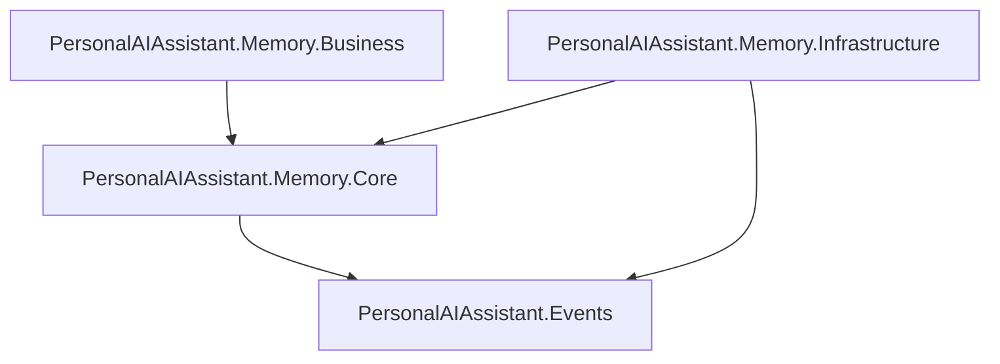

# Solution Inventory

## Repository Scope

This repository is a `.NET 8` class-library solution centered on a memory domain implemented with CQRS and event sourcing. The solution currently contains four projects and does **not** contain an executable API host, controller layer, `Program.cs`, or test project.

Relevant files:

- Solution: `PersonalAIAssistant.Memory.slnx`
- README: `README.md`
- Business project: `PersonalAIAssistant.Memory.Business/PersonalAIAssistant.Memory.Business.csproj`
- Core project: `PersonalAIAssistant.Memory.Core/PersonalAIAssistant.Memory.Core.csproj`
- Infrastructure project: `PersonalAIAssistant.Memory.Infrastructure/PersonalAIAssistant.Memory.Infrastructure.csproj`
- Events project: `PersonalAIAssistant.Events/PersonalAIAssistant.Memory.Events.csproj`

## Project Inventory

### `PersonalAIAssistant.Events`

Responsibility:

- Holds the shared event contracts used by the write model, projector, and event store serialization.

Key classes:

- `MemoryEvent`
- `MemoryAddedEvent`
- `MemoryUpdatedEvent`
- `MemoryCompressedEvent`
- `MemoryConsolidatedEvent`
- `MemoryIndexedEvent`
- `MemoryDeletedEvent`
- `SnapshotCreatedEvent`

Observations:

- This project is intentionally thin.
- Event contracts are mutable DTO-style classes rather than immutable records.
- No event contract versioning strategy is visible.

### `PersonalAIAssistant.Memory.Core`

Responsibility:

- Defines the domain model, DTOs, domain exceptions, and technology abstractions.

Major modules:

- `Domains/MemoryAggregate.cs`: primary aggregate root and event application logic
- `Domains/MemoryAggregateFactory.cs`: rehydration and snapshot payload helper
- `Domains/ValueObjects/MemoryId.cs`: strong aggregate identity
- `Interfaces/Mongo/IEventStore.cs`: write-side event store abstraction
- `Interfaces/Others/IEventBus.cs`: event publication abstraction
- `Interfaces/Others/ISnapshotRepository.cs`: snapshot persistence abstraction
- `Interfaces/Others/ICompressionService.cs`: compression abstraction
- `Interfaces/Others/IEmbeddingService.cs`: placeholder AI abstraction
- `Interfaces/Others/IVectorMemoryRepository.cs`: placeholder vector-store abstraction
- `Entities/*`: SQL read-model persistence shapes
- `Models/*`: read-side model contracts

Key domain responsibilities:

- Emits new events for add, update, compress, and delete operations
- Rehydrates from history via `LoadFromHistory(...)`
- Rehydrates from snapshot via `FromSnapshot(...)`
- Maintains aggregate version and uncommitted events

Observations:

- `MemoryAggregate` is the strongest implementation in the repo.
- `IEmbeddingService` and `IVectorMemoryRepository` are empty internal interfaces, so AI-readiness is still scaffolding.
- `MemoryAggregateFactory.CreateSnapshotPayload(...)` does not populate `MemorySnapshotDto.Status`, which creates a snapshot fidelity gap.

### `PersonalAIAssistant.Memory.Business`

Responsibility:

- Hosts application-layer commands, MediatR handlers, projection logic, and background workers.

Major modules:

- `Commands/*`
- `Handlers/*`
- `Projectors/MemoryEventProjector.cs`
- `Workers/ConsolidationWorker.cs`
- `Workers/SnapshotWorker.cs`

Commands found:

- `AddMemoryCommand`
- `UpdateMemoryCommand`
- `CompressMemoryCommand`
- `DeleteMemoryCommand`
- `ConsolidateMemoriesCommand`
- `MemoryIndexedCommand`
- `SnapshotCreatedCommand`

Handlers found:

- Implemented: `AddMemoryCommandHandler`, `DeleteMemoryCommandHandler`
- Empty stubs: `CompressMemoryCommandHandler`, `ConsolidateMemoriesCommandHandler`
- Missing: no handler files for `UpdateMemoryCommand`, `MemoryIndexedCommand`, or `SnapshotCreatedCommand`

Workers found:

- `ConsolidationWorker`: polls SQL read models for large memories and emits `MemoryCompressedEvent`
- `SnapshotWorker`: polls streams needing snapshots and stores snapshot payloads

Projector:

- `MemoryEventProjector` handles all current event types and updates the SQL read model

Observations:

- The Business project includes a `Queries` folder in the `.csproj`, but no implemented query objects or handlers.
- Command coverage is partial rather than complete.
- `ConsolidationWorker` is named for consolidation but actually performs compression/summarization.

### `PersonalAIAssistant.Memory.Infrastructure`

Responsibility:

- Provides concrete persistence and eventing implementations.

Major modules:

- `Mongo/MongoEventStore.cs`
- `Sql/SqlReadModelRepository.cs`
- `Context/ReadModelDbContext.cs`
- `InMemory/InMemoryEventBus.cs`

Infrastructure responsibilities:

- MongoDB append-only event storage with optimistic concurrency
- EF Core SQL read-model storage
- In-memory event publication stub that only logs

Observations:

- `MongoEventStore` is the most production-credible infrastructure component.
- `InMemoryEventBus` is not production-capable.
- No concrete `ISnapshotRepository`, `ICompressionService`, `IEmbeddingService`, or `IVectorMemoryRepository` implementation exists in this repo.

## Dependency Graph

### Actual project dependency graph



### Requested enterprise-layer graph vs current state

```text
Core            Present
Business        Present
Infrastructure  Present
Events          Present
API             Missing
Tests           Missing
```

## Package Inventory

### Business packages

- `MediatR`
- `Microsoft.Extensions.Hosting.Abstractions`
- `Microsoft.Extensions.Options`

### Infrastructure packages

- `Microsoft.EntityFrameworkCore`
- `Microsoft.EntityFrameworkCore.Abstractions`
- `Microsoft.Extensions.Logging.Abstractions`
- `MongoDB.Driver`

### Cross-cutting package gaps

- No authentication packages
- No message broker package
- No resilience package such as `Polly`
- No structured logging package such as `Serilog`
- No tracing/metrics package such as `OpenTelemetry`
- No test packages

## Module Responsibilities

### Aggregate

- `Domains/MemoryAggregate.cs`
- Owns lifecycle state for a memory record
- Emits domain events and applies replayed events

### Factory

- `Domains/MemoryAggregateFactory.cs`
- Rehydrates from full history or snapshot + tail events
- Generates JSON snapshot payloads

### Event store

- `Mongo/MongoEventStore.cs`
- Appends ordered events and enforces expected-version concurrency

### Read-model repository

- `Sql/SqlReadModelRepository.cs`
- Upserts summary read models
- Tracks processed events for idempotency
- Manages processing locks for worker coordination

### Projector

- `Projectors/MemoryEventProjector.cs`
- Transforms events into SQL read-model state

### Workers

- `Workers/ConsolidationWorker.cs`
- `Workers/SnapshotWorker.cs`

## Business Capability Status

| Capability | Status | Evidence |
| --- | --- | --- |
| Add memory | Implemented | `Commands/AddMemoryCommand.cs`, `Handlers/AddMemoryCommandHandler.cs`, `Domains/MemoryAggregate.cs` |
| Update memory | Partially implemented | `Commands/UpdateMemoryCommand.cs` exists, aggregate supports update, no handler |
| Compress memory | Partially implemented | `Commands/CompressMemoryCommand.cs`, empty handler, worker emits compression events |
| Delete memory | Implemented | `Commands/DeleteMemoryCommand.cs`, `Handlers/DeleteMemoryCommandHandler.cs`, aggregate supports delete |
| Consolidate memory | Missing/partial | Command exists, empty handler, projector supports event, aggregate lacks emit method |
| Index memory | Missing/partial | Command exists, projector supports event, no handler or concrete embedding/vector implementation |

## Key Classes And Functions

### `Domains/MemoryAggregate.cs`

Important functions:

- `AddMemory(...)`
- `UpdateRawText(...)`
- `Compress(...)`
- `Delete(...)`
- `LoadFromHistory(...)`
- `FromSnapshot(...)`

### `Mongo/MongoEventStore.cs`

Important functions:

- `AppendEventAsync(...)`
- `AppendEventsAsync(...)`
- `GetEventsAsync(...)`
- `GetEventsFromVersionAsync(...)`

### `Sql/SqlReadModelRepository.cs`

Important functions:

- `UpsertAsync(...)`
- `HasProcessedAsync(...)`
- `MarkProcessedAsync(...)`
- `GetConsolidationCandidatesAsync(...)`
- `TryMarkProcessingAsync(...)`
- `ExecuteInTransactionAsync(...)`

### `Projectors/MemoryEventProjector.cs`

Important functions:

- `Handle(MemoryAddedEvent, ...)`
- `Handle(MemoryUpdatedEvent, ...)`
- `Handle(IEnumerable<MemoryEvent>, ...)`
- `ApplyEventIfNotProcessedAsync(...)`

## Running And Build Instructions

### What can be run today

- The solution can be **built** successfully with `dotnet build`.
- The repository cannot be run end-to-end as an application because it lacks an API host and startup/bootstrap code.

### Verified build command

```bash
dotnet build .\PersonalAIAssistant.Memory.slnx
```

Result:

- Build succeeded locally with `0 Warning(s)` and `0 Error(s)`.

### What is required before the system is runnable

- A host project with `Program.cs`
- Dependency injection registration for MongoDB, EF Core, MediatR, workers, and abstractions
- Concrete implementations for:
  - `ICompressionService`
  - `ISnapshotRepository`
  - `IEmbeddingService`
  - `IVectorMemoryRepository`
- Configuration files for database connections and worker options

## Inventory Summary

This is a promising event-sourced module rather than a complete enterprise application. The domain model and event store are real, the read side is partially real, and the operational shell around them is largely missing.
